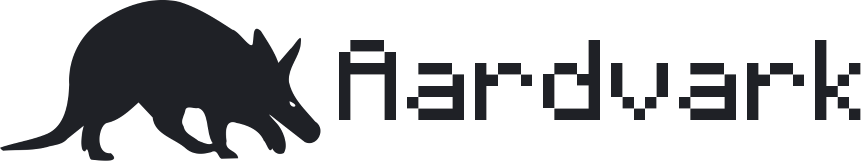
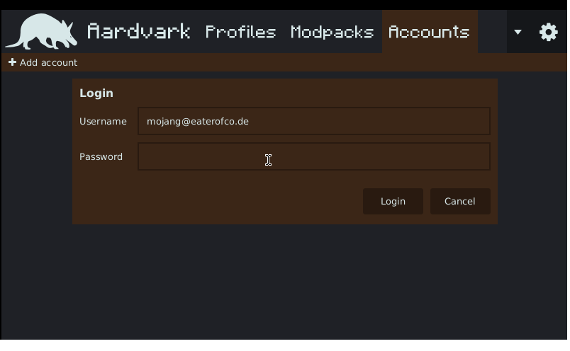
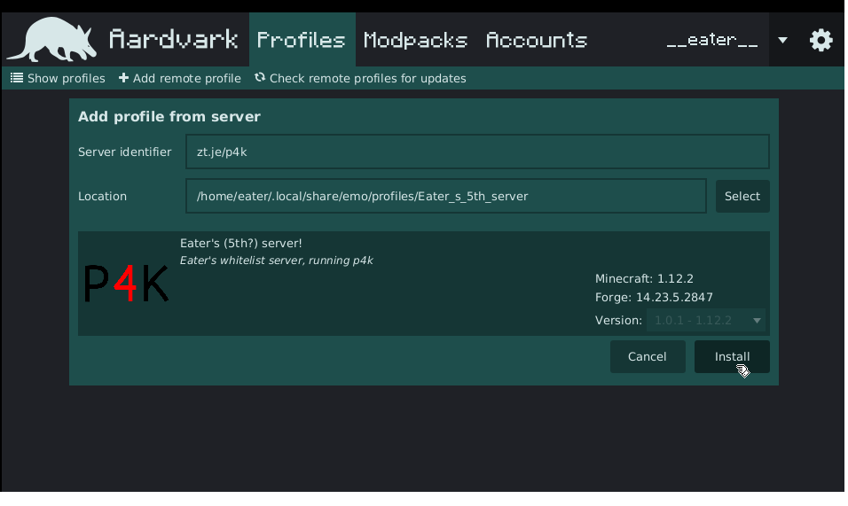
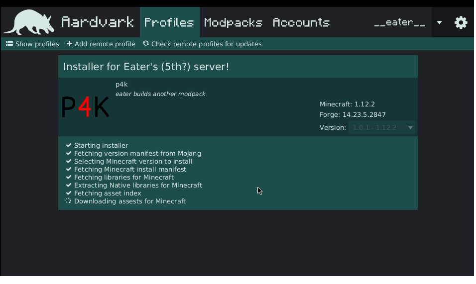
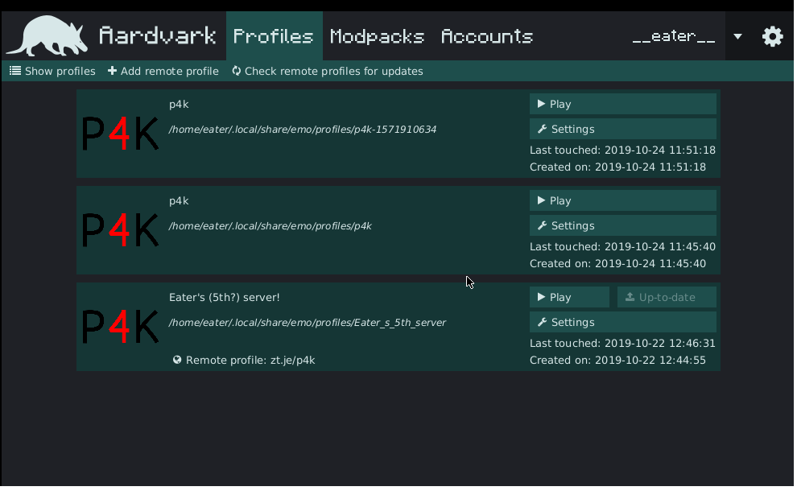

A mod organizer made to be used as little as possible

> Downloads can grabbed from the [releases page](https://github.com/EaterLabs/emo-aardvark/releases) or from the artifacts in the [last build](https://dev.azure.com/eaterlabs/Aardvark/_build?definitionId=1)

## Features

- Fully automatic modpack install
- No legal need to ask for mod permission
- Decentralized and user-configurable modpack repositories
- Remote profiles
- Multi-account support
- Easily hackable and brandable, without inconveniencing users with vendor lock-in
- Not electron based! works fine in low-memory environments (you can install full modpacks with only 50mb, which means more memory for your minecraft!)

### Remote profiles

Aardvark contains the unique feature of remote profiles, these are profiles with which you can track e.g. a server,
whenever they update their modpack, they'll update their remote profile and you can update your minecraft install with one click!

A server entry will be automatically added in the minecraft install, allowing you to instantly jump into the action!

Handles of remote profiles aren't complex either `zt.je` and `zt.je/i` are both valid remote handles

<details>
<summary>Technical details</summary>

Said handle is simply converted to `https://<host>/.well-known/aardvark/<path>.json`
if no path is given `https://<host>/.well-known/aardvark.json` is used

| handle | resulting url | 
| --- | --- |
| `zt.je` | `https://zt.je/.well-known/aardvark.json` |
| `zt.je/i` | `https://zt.je/.well-known/aardvark/i.json` |
| `zt.je/multi/level` | `https://zt.je/.well-known/aardvark/multi/level.json` |


the remote profile looks like the following:

```
{
  "repository": "https://raw.githubusercontent.com/EaterLabs/aardvark-repository/master/repository.json",
  "modpack": "eater/p4k",
  "version": "1.0.1",
  "name": "Eater's server!",
  "description": "Eater's whitelist server, running p4k",
  "servers": [	
    {
      "name": "Eater's server",
      "ip": "raquel.voor.money"
    }
  ]
}
```
</details>


### Distribution of modpacks (and mods)

A modpack in Aardvark isn't a zip with all the mods, instead it's a text (JSON to be exact) file pointing to the necessarry files.
This keeps modpacks simple to create, and light to distribute.

The downside to this is that Aardvark's modpacks are prone to breaking, the upside however is that there is never a redistribution of mods happening, since they are fetched from the preferred distributor of the author.
Meaning that Aardvark is not affected by any licensing that prohibits redistribution.

The default included mod repository is located at: [EaterLabs/aardvark-repository](https://github.com/EaterLabs/aardvark-repository)

If you want to build your own repository or modpack, I recommend creating a JSON file with any IntelliJ editor or VSCode and starting with

```json
{"$schema": "https://raw.githubusercontent.com/EaterLabs/emo-kt/master/schemas/repository.json"}
```

from there on you should be able to follow the auto-complete and error messages.

### Screenshots









---

### Build status

|||
|---|---|
|Windows|[](https://dev.azure.com/eaterlabs/Aardvark/_build/latest?definitionId=1&branchName=master)|
|OSX|[](https://dev.azure.com/eaterlabs/Aardvark/_build/latest?definitionId=1&branchName=master)|
|Linux|[](https://dev.azure.com/eaterlabs/Aardvark/_build/latest?definitionId=1&branchName=master)|

